<div align="center">

# GalStrike

### An open-world 3D web-swinging game that runs in your browser

<a href="https://galasulin.github.io/galstrike/"></a>


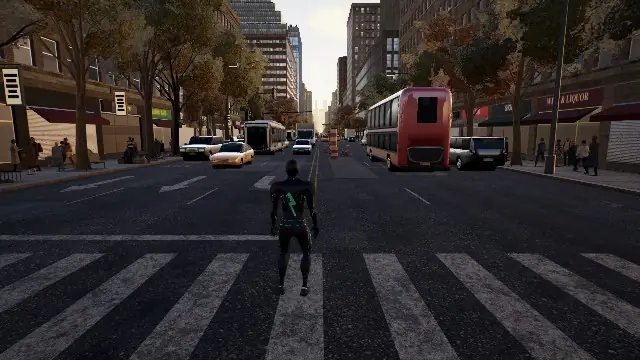
<sub>Real-time gameplay capture · GalStrike suit</sub>

**Swing across a procedural Manhattan, run up skyscrapers, stop street crimes and fight gangs, all in a browser tab.**<br/>
No install, no plugins: about 51,000 lines of hand-structured JavaScript on top of Three.js.

[**Play**](https://galasulin.github.io/galstrike/) · [Features](#-features) · [Screenshots](#%EF%B8%8F-screenshots) · [Controls](#-controls) · [Run locally](#-run-locally) · [Architecture](#%EF%B8%8F-architecture) · [עברית](#-בעברית)

</div>

---

## 📖 About

**GalStrike** is a real-time 3D action game in the browser. You traverse a Manhattan-style island built at load time from code: thousands of buildings, dressed rooftops, parks, Times Square, bridges, live traffic and crowds. On top of the traversal there is an open-world layer (research towers, districts, fast travel, collectibles, XP and a skill tree) and a melee combat system.

The project is by **Gal Asulin** ([@galasulin](https://github.com/galasulin)). The code was written with **Claude** (Anthropic's AI model, working through Claude Code) under human direction, which is also what the project demonstrates: how far agentic AI development can go on a large, performance-critical codebase.

> [!TIP]
> **Best experience:** desktop Chrome or Edge with a dedicated GPU. On a laptop with two GPUs, set Chrome to the high-performance GPU (NVIDIA Control Panel → *Manage 3D settings* → *Program Settings* → Chrome → *High-performance NVIDIA processor*). The first load takes about a minute: the city is generated on your machine.

---

## ✨ Features

### 🕸️ Traversal
- **Physics-based web-swinging** with release-and-launch, chained swings and momentum carried between them.
- **Wall-running, perching and parkour.** Stick to any facade, run up it, hop off it into a swing.
- **Web-zip and point-launch** to highlighted anchor points, plus air web-dash, quick web boost and head-first dives.
- **Web tightrope and web slingshot** for special movement.
- A **custom animation state machine** (skeleton, gait, clips and pose layers) drives a fully rigged character.

### 🏙️ A procedural city
- A **Manhattan-style island** with an authored street grid: Broadway, Greenwich Village, the Financial District, Central Park and Harlem.
- **Thousands of buildings** with facades, dressed rooftops (water towers, HVAC, gardens, antennas), shop fronts, awnings and signage.
- **Landmarks:** Times Square with LED screens and billboards, Grand Central, bridges and a waterfront with far shores.
- **Living streets:** traffic with junction logic, pedestrian crowds and pigeons.

### 🎮 Open-world gameplay
- **9 districts**, each with a **research tower** to activate. Activating one reveals the district on the map and unlocks its subway station for **fast travel**.
- **Street crimes** (muggings, bank alarms, car chases) spawn around you.
- **Melee combat** against three enemy types (melee, gunman and brute), with combos, dodges, web attacks, throws and finishers.
- **Progression:** XP, levels, a skill tree, collectibles (backpacks), landmarks and a **photo mode** with filters and stickers.
- **Saved progress** in the browser, a full **pause menu** (map, suits, skills, collectibles, settings) and a **developer menu** (`~`).

### 📜 Story missions *(new)*
- **8 story missions** against the *Static Crew*, a gang jamming the city's research towers, across Midtown, Hell's Kitchen, Chinatown, the Upper East Side, the Financial District and Harlem.
- **Objective types:** reach a landmark, activate or sync a tower, stop crimes, defeat enemies, recover backpacks, photograph a landmark, and **timed races through glowing rings** above the avenues.
- **Scoring:** objective points, a time bonus, a no-damage bonus and style points (combo and air time), then an **S / A / B / C rank**. Best score, rank and time are saved per mission, and a live HUD shows the timer, points and current objective.

### 🏆 Achievements and records *(new)*
- **21 achievements**, two of them hidden, with a gold unlock toast, a sound and an XP reward.
- **Records:** longest air time, top speed, best combo, best race times, distance swung, crimes stopped, enemies defeated and play time.

### 📱 Touch and tablets *(new)*
- **On-screen controls** switch on with the first touch: a floating joystick, drag-to-look, Swing, Jump, Zip, Boost, Dive and Parkour buttons, a context **Use** button near towers, and a separate combat button set.
- Pinch-zoom and scrolling are blocked, safe areas are respected, and phones in portrait get a *rotate your device* hint. Desktop is untouched.

### 🇮🇱 English and Hebrew *(new)*
- A complete **Hebrew interface** with right-to-left layout and bundled Hebrew fonts (**Secular One** for headings, **Heebo** for text). Switch live with the **EN / עב** toggle on the start screen or in Settings. Hebrew is picked automatically for Hebrew-language browsers, and `?lang=he` / `?lang=en` forces a language.

### 🔊 Sound, time and weather *(new)*
- An original, procedurally made score with day and night layers that react to swinging speed, plus positional sirens and alarms.
- The **start screen** has a sound panel (master, music and effects sliders, plus mute; <kbd>N</kbd> mutes in game) and a **time and weather picker**: day, morning, sunset, dusk, night or rain.

### 🎨 Rendering
- **Three.js WebGL2** with a custom post-processing pipeline: cascaded shadow maps (up to 5 cascades), SSAO, screen-space GI, screen-space reflections, bloom, TAA, depth of field, motion blur and light shafts.
- **Time-of-day presets** (morning, sunrise, day, sunset, dusk, night and overcast) plus **rain**, with wet streets and puddles.
- **Procedural sky and clouds**, atmospheric fog out to the horizon, and glass that mirrors the city.

---

## 🦸 Suits

**Ten suits**, recoloured live by a GPU shader (no extra textures, and switching never recompiles). Pick them in **Pause → Suits** or from the start screen.

<p align="center">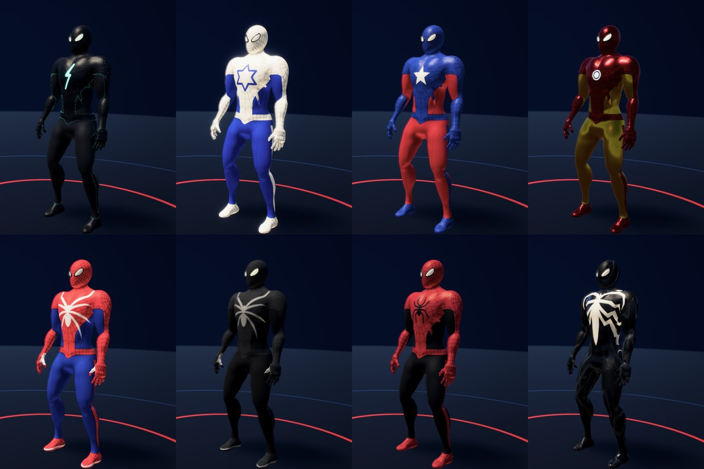</p>
<p align="center"><sub>GalStrike · Israel · Captain America · Iron Man — Classic · Stealth · Scarlet · Symbiote (real in-game captures)</sub></p>

| Suit | Look | Emblem / detail |
|---|---|---|
| ⚡ **GalStrike Suit** *(new)* | Matte black with **glowing neon-turquoise web lines** | Glowing **lightning bolt**, the signature suit |
| 🇮🇱 **Israel Suit** *(new)* | Flag white and deep blue | **Star of David** on chest and back |
| ⭐ **Captain America Suit** *(new)* | Navy and red | White **star** |
| 🔴 **Iron Man Suit** *(new)* | Hot-rod red and gold metal | Glowing **arc reactor** |
| **Classic Suit** *(new)* | Bright red and royal blue | Bold black web |
| **Stealth Suit** *(new)* | Matte graphite | Lenses glow green |
| **Scarlet Suit** *(new)* | Deep scarlet with black panels | Black spider emblem |
| **Advanced Suit** | Red / navy / white | The default suit |
| **Iron Spider** | Crimson and gold armour | Unlocks at level 5 |
| **Symbiote Suit** | Wet black with a white emblem | Procedural veins, heavy black webs |

The new emblems (lightning bolt, five-point star, Star of David, arc reactor) are signed-distance-field shapes drawn by the shader directly on the character's body, so they stay sharp at any resolution.

---|---|---|
| **Advanced Suit** | Red / navy / white | The default suit |
| **Iron Spider** | Crimson and gold armour | Unlocks at level 5 |
| **Symbiote Suit** | Wet black with a white emblem | Procedural veins, heavy black webs |
| 🇮🇱 **Israel Suit** | Flag white and deep blue | **Star of David** emblem on chest and back *(new in GalStrike)* |
| ⭐ **Captain America Suit** | Navy and red | White **star** emblem *(new in GalStrike)* |
| 🔴 **Iron Man Suit** | Hot-rod red and gold metal | Glowing **arc reactor** *(new in GalStrike)* |

The new emblems (five-point star, Star of David, arc reactor) are signed-distance-field shapes drawn by the shader on the character's body, so they stay sharp at any resolution.

---

## 🖼️ Screenshots

<p align="center">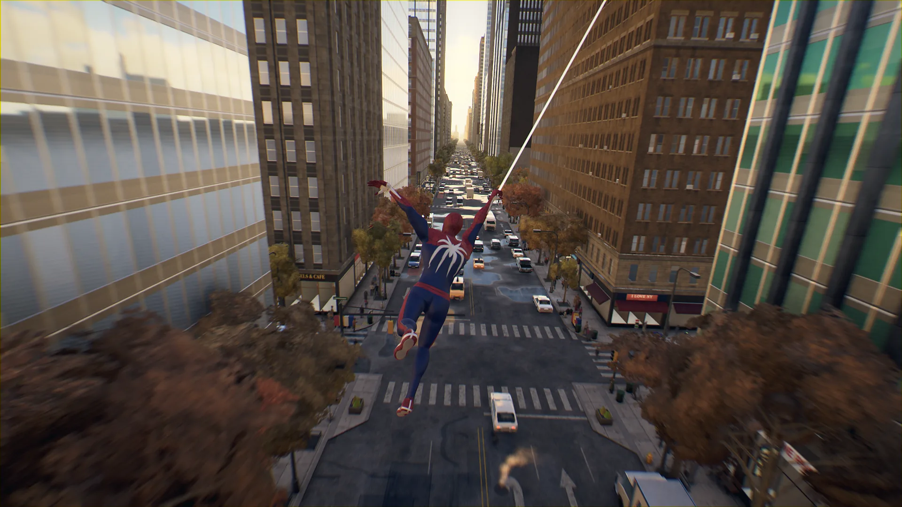</p>
<p align="center"><sub><b>Midtown · golden hour</b></sub></p>

<p align="center">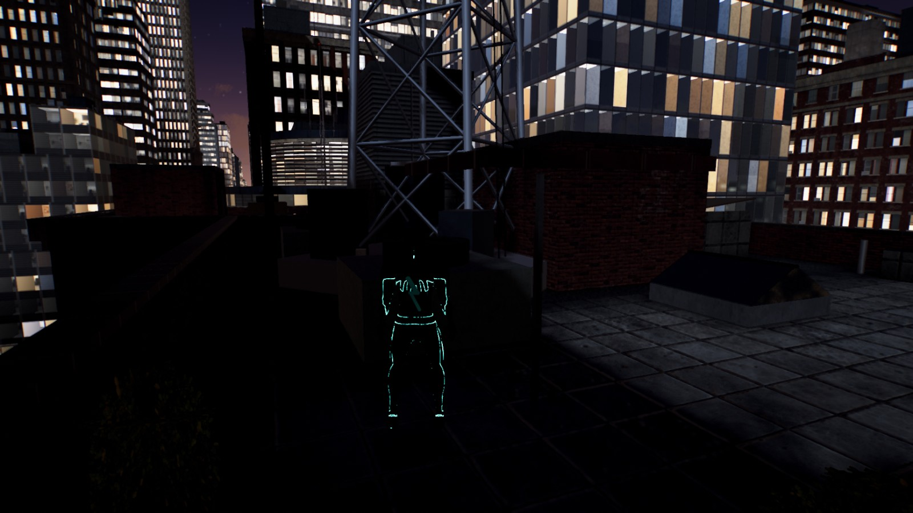</p>
<p align="center"><sub><b>The GalStrike suit on a Midtown rooftop at night</b> · real in-game capture</sub></p>

<table>
  <tr>
    <td width="50%">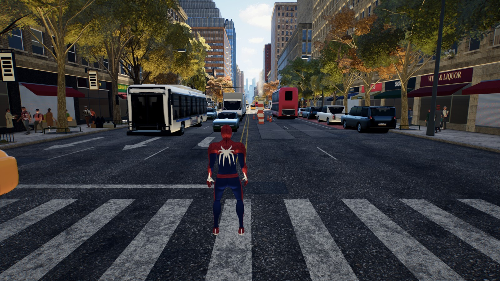<p align="center"><sub><b>Street level · live traffic and crowds</b></sub></p></td>
    <td width="50%">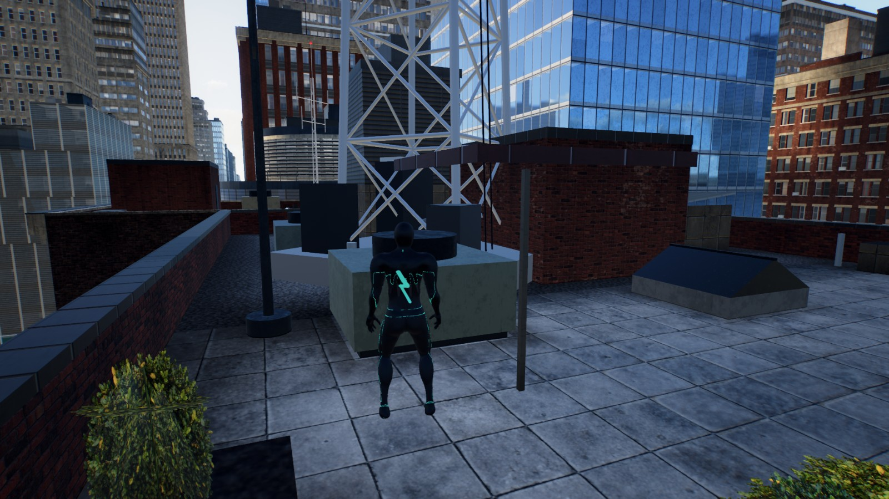<p align="center"><sub><b>Midtown rooftop · GalStrike suit</b></sub></p></td>
  </tr>
</table>

<table>
  <tr>
    <td width="50%">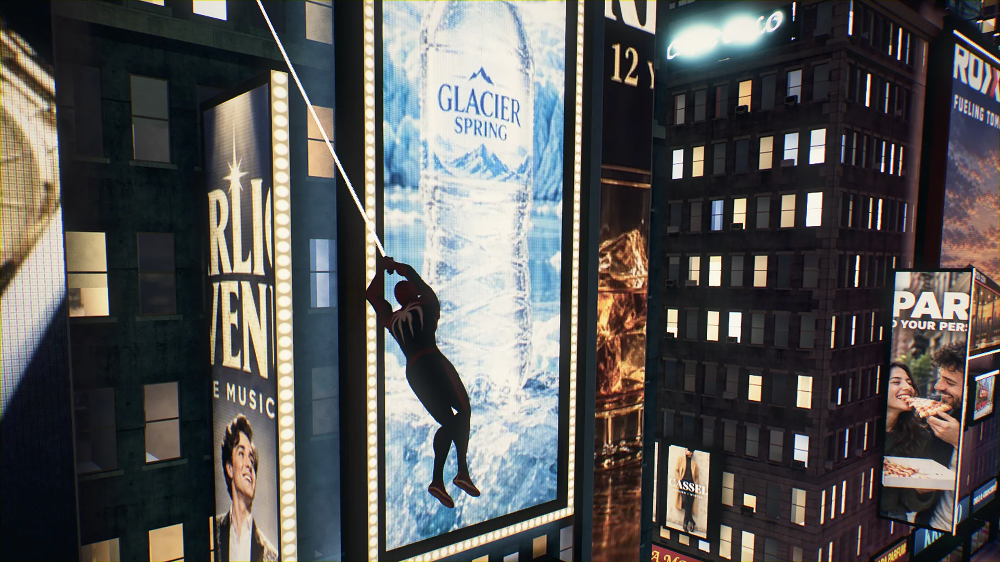<p align="center"><sub><b>Times Square · night</b></sub></p></td>
    <td width="50%">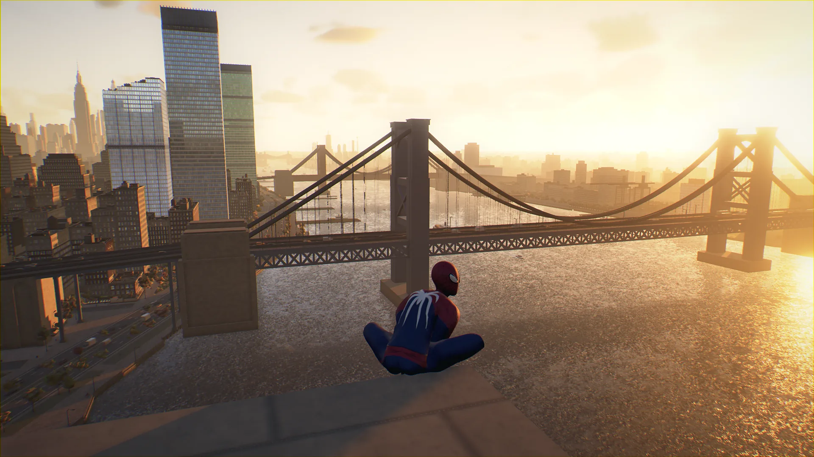<p align="center"><sub><b>Brooklyn Bridge · sunrise</b></sub></p></td>
  </tr>
  <tr>
    <td width="50%">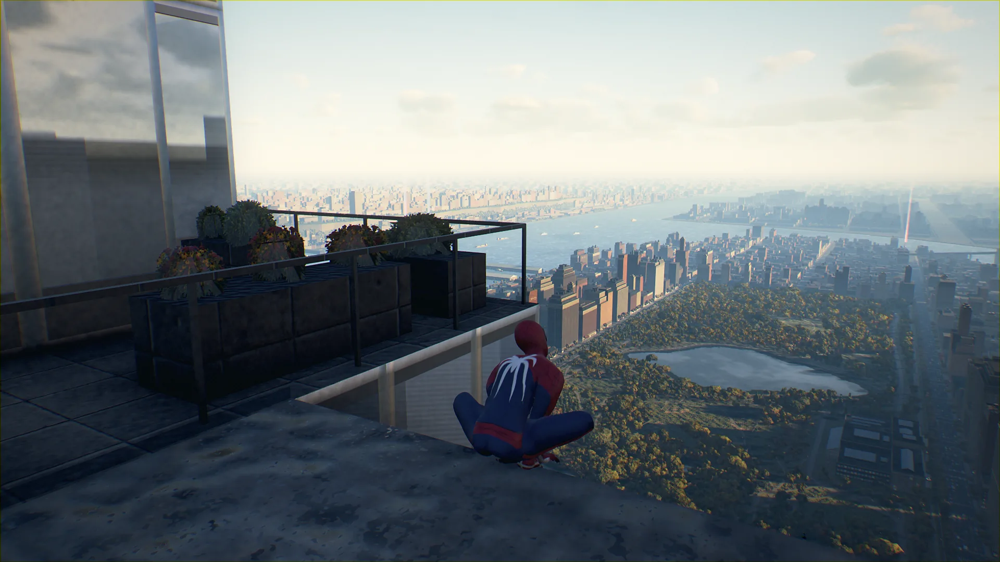<p align="center"><sub><b>Central Park · morning</b></sub></p></td>
    <td width="50%">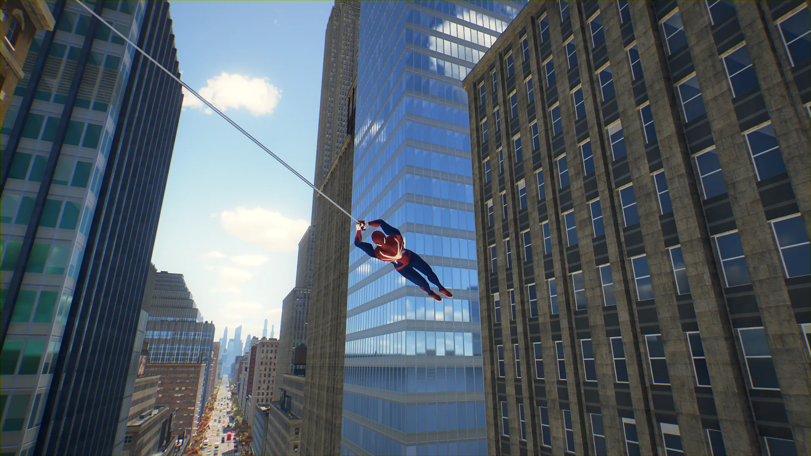<p align="center"><sub><b>Midtown · noon</b></sub></p></td>
  </tr>
  <tr>
    <td colspan="2">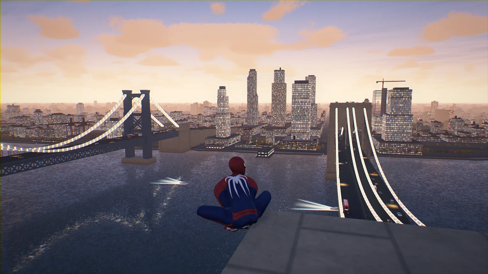<p align="center"><sub><b>East River · dusk</b></sub></p></td>
  </tr>
</table>

---

## ⚡ What GalStrike adds

| Area | Change |
|---|---|
| **Start screen** | A GalStrike title screen with a slow cinematic orbit around the hero. Play, Suits and Settings, driven by mouse, keyboard or gamepad. |
| **New suits** | GalStrike (glowing neon web lines), Israel, Captain America, Iron Man, Classic, Stealth and Scarlet, with new procedural emblems and emissive details. |
| **Gamepad interact** | Hold D-pad Up (or X / Square outside combat) to activate towers and interact. |
| **Auto quality** | On load the game reads the GPU name and picks a preset (low for integrated GPUs, medium for mid-range and APUs, high for dedicated GPUs). It re-checks on every load, so when the browser moves to the dedicated GPU the preset follows, until you choose one by hand. |
| **Dynamic resolution** | If frames stay slow for 2 seconds, internal resolution drops in 10% steps (down to 55%), and climbs back when there is headroom. |
| **Smooth mouse look** | Raw, unaccelerated mouse input (`unadjustedMovement`), plus a filter for the bogus pointer-lock spikes Chrome sometimes sends on Windows, which used to throw the camera around. |
| **Story missions** | 8-mission chain with races, scoring, ranks and saved bests, plus a Missions page in the pause menu. |
| **Achievements** | 21 achievements, a Records panel and gold unlock toasts. |
| **Touch controls** | Full on-screen controls for tablets and phones. |
| **Hebrew UI** | Full RTL Hebrew translation with Secular One and Heebo fonts, switchable live. |
| **Start screen setup** | Time and weather picker, sound sliders and mute. |
| **Live demo** | Asset URLs are base-path aware, and a GitHub Actions workflow builds and deploys to GitHub Pages on every push. |

---

## 🎮 Controls

<table>
<tr><th>Action</th><th>⌨️ Keyboard and mouse</th><th>🎮 Gamepad (Xbox / PlayStation)</th></tr>
<tr><td>Move</td><td><kbd>W</kbd> <kbd>A</kbd> <kbd>S</kbd> <kbd>D</kbd></td><td>Left stick</td></tr>
<tr><td>Camera</td><td>Mouse (click the game to capture it)</td><td>Right stick</td></tr>
<tr><td>Web-swing (hold)</td><td>Right mouse button</td><td><kbd>R2</kbd> / <kbd>RT</kbd> (in the air)</td></tr>
<tr><td>Jump (hold = charged jump)</td><td><kbd>Space</kbd></td><td><kbd>A</kbd> / <kbd>✕</kbd></td></tr>
<tr><td>Parkour and wall-run</td><td><kbd>Shift</kbd></td><td><kbd>R2</kbd> on the ground or on walls</td></tr>
<tr><td>Web-zip / point-launch</td><td><kbd>E</kbd> or middle mouse button</td><td><kbd>L2</kbd> + <kbd>R2</kbd>, or <kbd>Y</kbd> / <kbd>△</kbd></td></tr>
<tr><td>Quick web boost (air)</td><td><kbd>Q</kbd></td><td><kbd>L1</kbd> / <kbd>LB</kbd></td></tr>
<tr><td>Dive / drop</td><td><kbd>C</kbd> or <kbd>Ctrl</kbd></td><td><kbd>B</kbd> / <kbd>◯</kbd></td></tr>
<tr><td>Web tightrope (while perched)</td><td><kbd>T</kbd></td><td>—</td></tr>
<tr><td>Interact (activate tower, hold)</td><td><kbd>F</kbd></td><td>D-pad <kbd>▲</kbd>, or <kbd>X</kbd> / <kbd>▢</kbd> outside combat</td></tr>
<tr><td>Pause menu / map</td><td><kbd>Esc</kbd> / <kbd>M</kbd></td><td><kbd>Start</kbd> / <kbd>Select</kbd></td></tr>
<tr><td>Help overlay</td><td><kbd>H</kbd></td><td>—</td></tr>
<tr><td>Mute / unmute</td><td><kbd>N</kbd></td><td>—</td></tr>
</table>

> [!NOTE]
> **Gamepad:** connect it before opening the game, then press any button. Browsers only expose a controller after its first input.

---

## 🚀 Run locally

**Requirements:** [Node.js](https://nodejs.org) 20.19+ or 22.12+, and a WebGL2 browser (desktop Chrome or Edge recommended).

```bash
git clone https://github.com/galasulin/galstrike.git
cd galstrike
npm install
npm run dev        # http://127.0.0.1:5173
```

```bash
npm run build      # production build in dist/
npm run preview    # serve the build on http://127.0.0.1:4173
```

<details>
<summary><b>Useful URL parameters</b></summary>

| Parameter | Effect |
|---|---|
| `?q=low` · `?q=med` · `?q=high` | Force a graphics preset |
| `?notitle` | Skip the start screen |
| `?lang=he` · `?lang=en` | Force the interface language |
| `?nodynres` | Turn off dynamic resolution |
| `?newgame` | Wipe the saved progress |
| `?fresh` | Don't restore the last player position |
| `?dev` | Enable the developer menu (`~`) on a production build |

</details>

<details>
<summary><b>Troubleshooting</b></summary>

- **Black screen or very low FPS:** open `chrome://gpu` and check `GL_RENDERER`. If it says Intel on a laptop with an NVIDIA or AMD GPU, switch Chrome to the high-performance GPU (see the tip above), then fully restart Chrome.
- **Camera too fast:** Pause → Settings → Mouse Sensitivity, or lower your mouse DPI to 800–1600.
- **Stutters:** lower Pause → Settings → Render Resolution, or pick the Low preset.

</details>

---

## 🏗️ Architecture

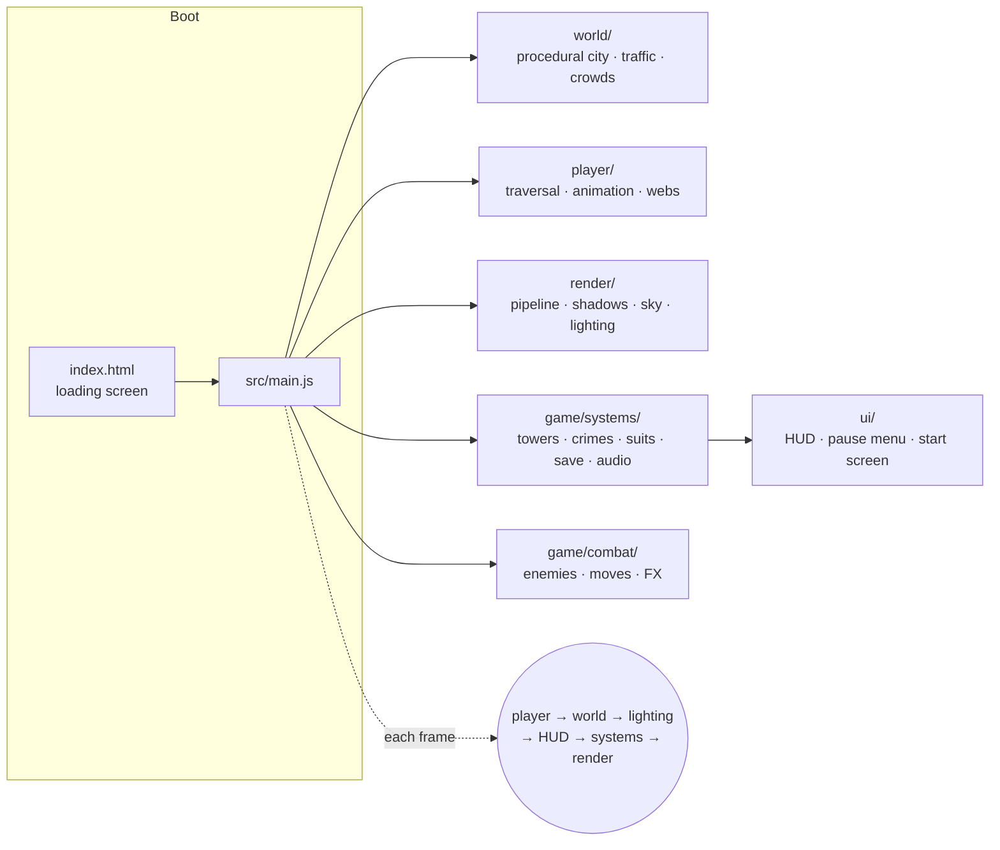

| Module | Lines | What it does |
|---|---:|---|
| `src/world/` | ~30,600 | City layout, buildings, facades, rooftops, Times Square, parks, bridges, waterfront, signage, traffic and crowds |
| `src/player/` | ~8,300 | Traversal state machine, rope physics, web visuals, camera, animation rig and gait |
| `src/game/` | ~5,800 | Open-world systems (towers, crimes, suits, progression, save, audio, photo mode) and combat |
| `src/render/` | ~3,800 | Post-processing pipeline, cascaded shadows, sky and clouds, time of day, quality presets |
| `src/ui/` | ~1,900 | HUD, minimap, pause-menu pages and the start screen |

**126 source files · about 51,000 lines of JavaScript · about 140 MB of assets** (models, textures, audio and fonts).

<details>
<summary><b>Project layout</b></summary>

```text
galstrike/
├─ index.html                 # loading screen + entry
├─ vite.config.js             # base path switch for GitHub Pages
├─ public/assets/             # character / enemy models, city textures, audio, fonts, loading stills
├─ src/
│  ├─ main.js                 # renderer, scene, main loop, dynamic resolution
│  ├─ world/                  # procedural Manhattan (city, buildings, rooftops, npc/ …)
│  ├─ player/                 # traversal/, anim/, input, camera, webs
│  ├─ render/                 # pipeline, csm, sky, lighting, quality
│  ├─ game/systems/           # towers, crimes, suits, progression, save, audio …
│  ├─ game/combat/            # combat loop, enemies, moves, FX
│  └─ ui/                     # hud, menus/ (pause, map, suits, settings, title)
└─ .github/workflows/pages.yml
```

</details>

---

## 🛣️ Roadmap

- [x] Gamepad binding for *interact* (tower activation)
- [x] Touch controls for phones and tablets
- [ ] More suits and suit abilities
- [x] Story missions with objectives and scoring
- [x] Achievements and records
- [x] Full Hebrew interface (RTL, Secular One + Heebo)
- [ ] Leaderboards

---

## 🇮🇱 בעברית

**GalStrike** הוא משחק תלת-ממד בעולם פתוח שרץ ישירות בדפדפן: מתנדנדים על קורים מעל מנהטן, רצים על גורדי שחקים, עוצרים פשעים ברחובות ונלחמים בכנופיות. בלי התקנה.

- 🕸️ **תנועה:** סווינג מבוסס פיזיקה, ריצה על קירות, זינוק לנקודות, צלילה וחבל קורים.
- 🏙️ **עיר שנבנית מקוד:** אלפי בניינים, גגות, פארקים, טיימס סקוור, גשרים, תנועה והולכי רגל.
- 🎮 **עולם פתוח:** 9 רובעים עם מגדלים להפעלה, נסיעה מהירה ברכבת, פשעים ברחובות, קרבות, XP, עץ כישורים ומצב צילום.
- 🦸 **10 חליפות**, ביניהן חליפת החתימה **GalStrike** עם קווי ניאון זוהרים, **חליפת ישראל** עם מגן דוד, **Captain America** ו-**Iron Man** עם כור ארק זוהר.
- 📜 **8 משימות סיפור** עם מרוצים, ניקוד ודירוג S/A/B/C, ו-**21 הישגים** ושיאים.
- 📱 **תמיכה במגע ובטאבלטים** עם ג'ויסטיק וכפתורים על המסך.
- 🔊 **סאונד, שעה ומזג אוויר** מתפריט הפתיחה.
- 🇮🇱 **ממשק מלא בעברית** מימין לשמאל, עם פונטים Secular One ו-Heebo, ומעבר בין עברית לאנגלית בלחיצה.
- ⚡ **ביצועים:** בחירת איכות אוטומטית לפי כרטיס המסך, רזולוציה דינמית, ותנועת מצלמה חלקה (קלט עכבר גולמי).

**▶ [לשחק עכשיו](https://galasulin.github.io/galstrike/)**. מומלץ מחשב עם כרטיס מסך נפרד. הטעינה הראשונה לוקחת כדקה.

פרויקט של **גל אסולין**. הקוד נכתב באמצעות **Claude** (Claude Code) בהכוונת אדם.

---

## ⚖️ License and disclaimer

Source-available, view-only. See [LICENSE](LICENSE). No commercial use or redistribution without written permission.

This is an **unofficial, non-commercial fan project**, made only as a technical demonstration. It is not affiliated with, endorsed by or sponsored by Marvel, Disney, Sony or Insomniac Games. Spider-Man, Captain America, Iron Man and all related names, characters and likenesses are trademarks and copyrighted material of their respective owners, and no rights to them are claimed. The bundled fonts are licensed under the SIL Open Font License (see `public/assets/ui/fonts/`).

<div align="center"><sub>Made by <a href="https://github.com/galasulin">Gal Asulin</a> · Built with Claude Code</sub></div>
